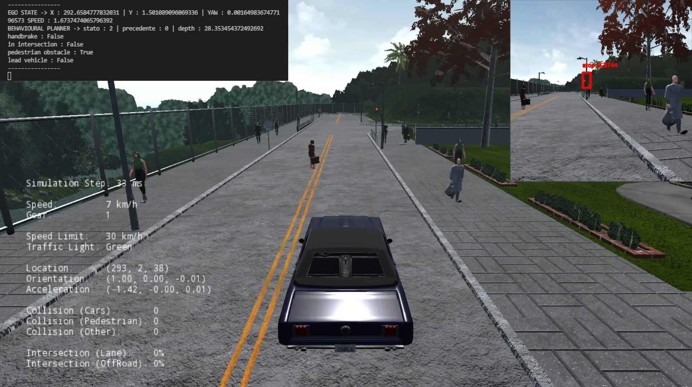

# Autonomous Vehicle Driving Project

A solution to implement both traffic light recognition https://github.com/affinis-lab/traffic-light-detection-module and pedestrian/vehicle obstacle management in Carla 0.8.4

